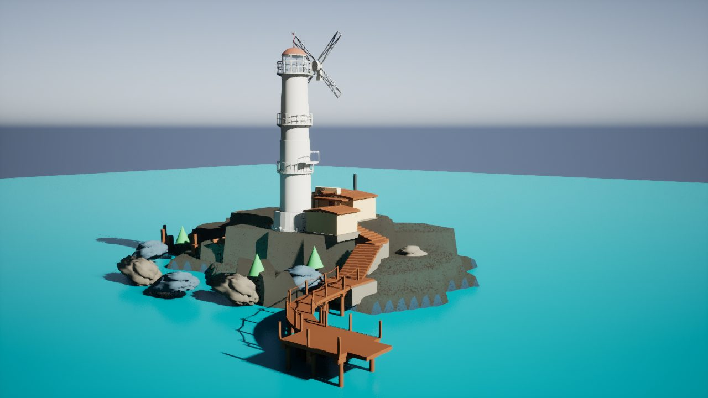
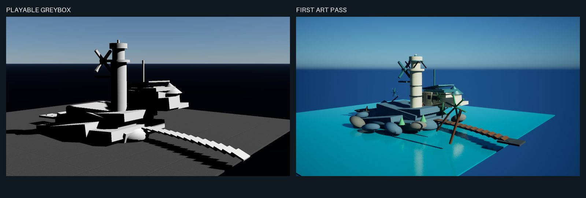
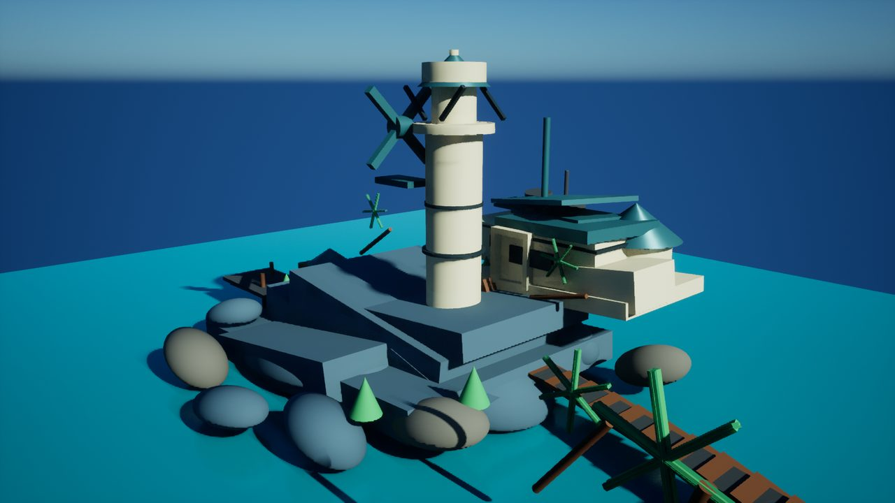
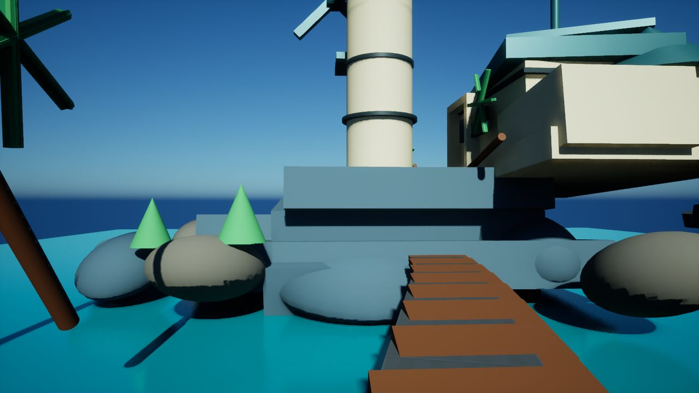
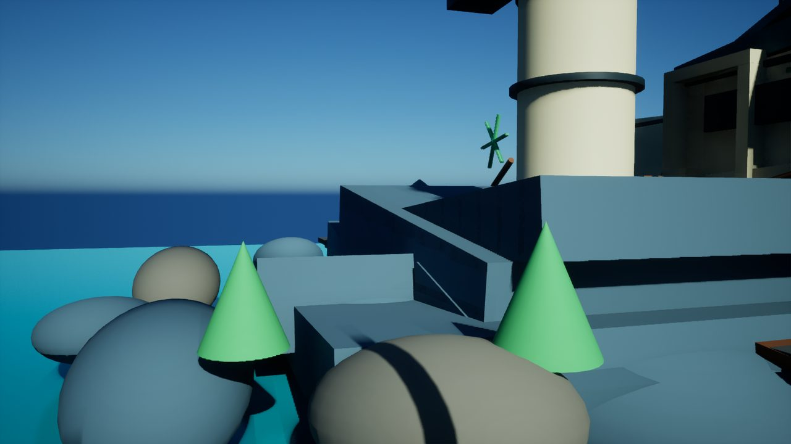

<h1 align="center">Tidemark</h1>

  <strong>Unreal Engine 5 · Environment Art · Technical Art</strong> 
  A reference-driven lighthouse-island environment study built around controlled visual iteration, modular scene structure, and evidence-backed validation.

  
  
  
  

  <b>Current status — Integrated visual blockout. G012 is retained by technical self-audit; Human Art review is still pending. No canonical promotion has been performed.</b>

  
   
  <b>G012 — fixed <code>ArtTargetCamera_C027</code> capture · retained candidate blockout · Human Art review PENDING</b> 
  Six settlement volumes, tower and approach dock inside one protected frame. The grey rock and flat water are deliberate blockout material, not final art.

## Current Build

The project has moved well beyond the old **“First Art Pass awaiting human review”** state.

The current retained visual candidate is **G012 — Visible Settlement Density & Front Apron Closure**. It keeps the established boardwalk / water composition while improving the lighthouse settlement as one integrated mass: stronger visible architecture density, asymmetric clustering, upper / mid / lower spatial reading, tower grounding, terrain contact, and shore-to-settlement access logic.

Technical self-audit for G012 reached **STRONG_PARTIAL** on the major visual blockout gates, with **PASS** on boardwalk composition, water negative space, and protected-regression checks. Human Art acceptance remains pending.

The package lineage is intentionally conservative: **G004 remains the UE source provenance**, while G012 is a retained candidate blockout rather than a canonical replacement.

## Visual Gallery

<table>
<tr>
<td width="50%">
 
<b>G012 — fixed HERO camera.</b> The same settlement from the second protected primary view: five room identities read independently, and Station01 is no longer lost inside the tower silhouette.
</td>
<td width="50%">
 
<b>G004 — same HERO camera, UE source provenance.</b> The stable source measured against, so "retained" is not a bare assertion: both frames come from <code>scenespec_camera_hero</code> at the identical transform (location −4700, −4100, 1350 cm; rotation −6°, 52°; FOV 58; 1280×720; camera move count 0). Settlement density and shore layering are what changed; tower transform and water negative space did not.
</td>
</tr>
</table>

### Recent convergence — G010 → G011 → G012

The comparison shows the recent integrated-settlement phase: G010 restored visible density, G011 improved asymmetry / grounding / platform relationships, and G012 combines those lessons into the first candidate **of this phase** to clear the supplied technical retention gate (G010 and G011 were rated PARTIAL / not retained). All three panels use identical protected camera poses; G010 and G011 are **not retained**, and are shown as evidence rather than as current state.

## Technical Art / Environment Work

Implemented and evidenced in the current project:

- Semantic scene construction and replaceable visual layers.
- Separation between **visual blockout** and the protected gameplay / collision surface.
- Fixed-camera review from governed C027 / HERO / OVERVIEW viewpoints.
- Iterative Blender → UE candidate authoring for island geology and settlement massing.
- Candidate-only terrain / architecture changes with protected-source regression checks.
- Building / terrain interface auditing: foundation contact, entrance → landing → stair/path → yard relationships.
- Boardwalk / dock / shoreline composition kept independent from visual terrain experiments.
- Real ACharacter regression on the inherited protected gameplay surface.
- Save / reload with a fresh-process actor-ledger regression (3157 actors, zero unexpected diffs), package hashing, evidence manifests, and fail-closed production guards.

Important evidence boundary: the G012 Character regression validates the **inherited G004 gameplay collision only**. It does **not** certify the new visual terrain or new visual stairs as walkable production geometry.

## Development Progress

### Early greybox / First Art Pass

The original public showcase stopped around the first visual pass. That material is now historical progress evidence rather than the project’s current state.

### World structure and reference convergence

Subsequent work rebuilt the environment logic around a more plausible island / shoreline / settlement relationship, while preserving protected gameplay and camera constraints. Terrain, boardwalk relation, water negative space, tower hierarchy, and settlement massing were iterated as isolated candidates rather than overwritten in place.

### Integrated settlement phase

G010–G012 shifted the problem from “terrain-only convergence” to **architecture + geology + circulation as one composition**. G012 is the first retained candidate of this phase.

<b>Development history — earlier captures (not current state)</b>

<table>
<tr>
<td width="33%">
 
<b>First Art Pass.</b> The capture originally used for public review. Historical evidence only.
</td>
<td width="33%">
 
<b>Route view.</b> Character-traversal check on the protected gameplay surface.
</td>
<td width="33%">
 
<b>Boardwalk detail.</b> The approach composition later kept stable across candidates.
</td>
</tr>
</table>

These images are archived project evidence. None of them describes the current retained candidate, and they are kept out of the first screen on purpose.

## Current Focus

Human review of G012 is now the main gate.

The current questions are visual rather than purely technical:

- Is the settlement density sufficient from the fixed hero views?
- Does the island read as a stepped, asymmetric coastal settlement instead of an oval terrain mass?
- Are tower, support buildings, terraces, stairs, and shoreline integrated convincingly?
- Which blockout relationships should be frozen before production asset work?

## Next Milestone

If Human Art review accepts the G012 direction:

1. Freeze the integrated island / settlement layout.
2. Convert the strongest blockout relationships into targeted production assets.
3. Continue terrain / coast naturalism, architecture refinement, vegetation composition, and material development.
4. Validate any future gameplay handoff separately from visual terrain authoring.

If Human Art review rejects the composition, iteration stays candidate-only; the canonical scene is not silently replaced.

## Status / Limitations

- **Human Art:** PENDING.
- **Canonical promotion:** NOT PERFORMED.
- **Current retained visual candidate:** G012.
- **UE source provenance:** G004 — selected as the best generation of its overnight run, which was itself rated **PARTIAL** with an open `GAMEPLAY_RELATION = CONFLICT`. "Source provenance" means the lineage G012 was measured against, not a finished or approved scene.
- **New visual terrain walkability:** NOT CERTIFIED.
- **Final materials / vegetation / coast art:** NOT COMPLETE.
- **Lighting / camera:** protected; current comparisons do not fabricate camera alignment to the concept.
- The concept reference is used for composition and massing guidance; it is not camera-calibrated, so raw pixel similarity is not treated as an acceptance metric.

## Distribution / Attribution

This repository is a teacher / portfolio review surface, not a full project distribution.

It does **not** publish the complete UE project, Saved / Intermediate / DDC / Build outputs, private agent logs, credentials, or unverified third-party source assets.

The current showcase images are derived from real project captures. No AI-generated image is presented as Unreal Engine runtime output.

[Technical overview](docs/technical-overview.md) · [Current status](docs/status.md) · [Showcase sync audit](docs/TIDEMARK_SHOWCASE_SYNC_AUDIT.md)

[Lilith — Portfolio](https://github.com/lilith-techart)
