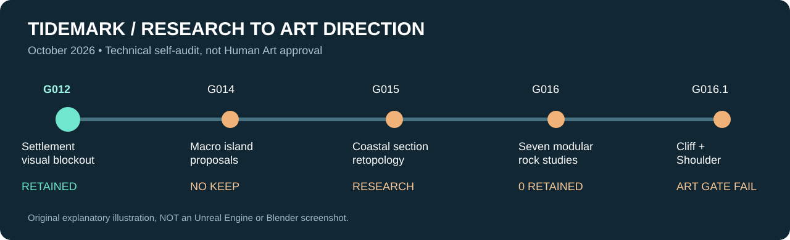

# 01 / From full-island geometry to local rock research

[← Process archive](README.md)

## Starting point — G012

G012 retained a more legible lighthouse settlement blockout, keeping the broad boardwalk composition and water negative space. Retention was based on **technical self-audit**, not Human Art acceptance. The new visual terrain is not certified as a walkable gameplay layer.

## What failed, and why

| Experiment | Method / focus | Outcome |
| --- | --- | --- |
| G013 | Local geology and building-ground interfaces | Minor grounding gains; coastal profile still weak; rejected |
| G014 | Three separate macro-island proposals in Blender | Artificial horizontal terraces and vertical walls; no UE candidate |
| G015 | Local geological cross-section prototype | Loft remains too smooth / band-like; did not advance to island |
| G015 tool bakeoff | Blender sculpt / Voxel / QuadriFlow | Topology improved; naturalism **not proven** |

The repeated problem was **large-form shape design**: better triangulation, remeshing and more procedural detail did not eliminate extended slab surfaces. This resulted in a deliberate shift to function-specific rock modules.

**Takeaway:** If the main coastal silhouette is not convincing in neutral clay, stop before UE integration. Rejected research meshes are not current showcase assets.