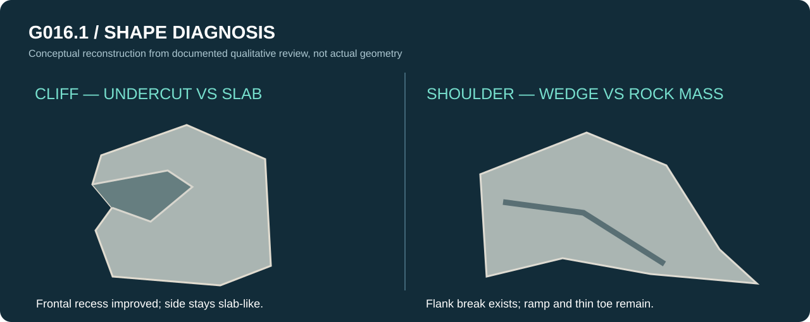

# 02 / G016 modular rock kit — seven trials, no production asset

[← Process archive](README.md)

## Research brief

G016 attempted to create reusable coastal rock pieces rather than remake the full island. The local research inventory covered **884 entries**. Seven candidate rock modules and a coastal assembly were constructed and evaluated.

**Reported evidence:**

| Gate | Result |
| --- | --- |
| Distinct study modules | 7 |
| Art-retained modules | **0** |
| Coastal prototype | Created; **not retained** |
| Clay art review | **Failed required gate** |
| Blender / FBX reload | PASS |
| UE production import | Not run |
| G012 scene | Unmodified |

## Lessons observed

The modules had clearer geometric silhouettes than earlier generic tests, but repeated chamfered pillars, overly planar faces and disconnected boulders still dominated the read. Assemblies did not produce credible rock strata. Increasing mesh density, topology neatness or visual material polish would not prove otherwise.

The next experiment deliberately reduced the scope to **two functions**: a vertical short **Cliff** and a directional upper-to-lower **Shoulder**. These should have clearly different supporting masses rather than be scaled versions of one another.

**Status:** research only. No downloadable production rock kit is claimed.