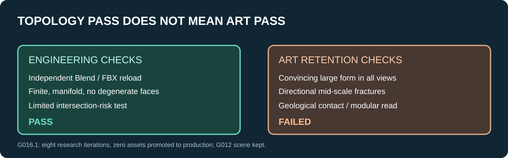

# 03 / G016.1: Cliff and Shoulder, eight art-gated iterations

[← Process archive](README.md)

> **TECHNICALLY VALID / ART GATE FAILED / RESEARCH ONLY**
>
> G012 remains the latest retained visual scene. Human Art remains PENDING.

## The design question

Can a source-controlled Blender workflow generate more than cropped pillar and wedge shapes? We investigated a **Cliff** (localized vertical coastal break) and a **Shoulder** (descending support mass from upper rock terrace to lower shore).

## Actual sequence

| Version | Authored change | Visual verdict |
| --- | --- | --- |
| cliff1 | Explicit brow / recess cage | Full-width ledge; tall planar back |
| cliff2 | Localized recess; tapered sides | Stepped folded-plate read survives |
| cliff3 | Voxel 0.075 m, 3 relaxation passes and decimate | Seams soften, slab volume remains |
| cliff4 | Reorient crown / erode a flank | Front improves, **side remains slab** |
| shoulder1 | Independent downhill cage | Triangular ramp and abrupt closure |
| shoulder2 | Asymmetric flank / local depression | Ramp continues |
| shoulder3 | Narrower lower volume / upper support patch / voxel | Junction improves, wedge persists |
| shoulder4 | Local fracture, tapered toe, finite recess | Better local change, thin-looking toe persists |

Each was evaluated at controlled meter-scale multi-views. These diagrams illustrate the diagnosis; they are **not extracted mesh geometry**.

## What the evidence proves

**Technical:** independent Blender readback and FBX import passed for all eight candidates and diagnostic baselines. Meshes were nonempty, finite, manifold and nondegenerate; a limited nonadjacent BVH-pair risk check found no pairs. This check is **not an exhaustive self-intersection certificate**.

**Art:** both best research variants improved localized brow / recess or flank structure, but retained their dominant slab/wedge profiles from key views. **Neither passed the art self-audit retention gate.** No micro-assembly was built because the two modules failed that prerequisite.

**Safety:** no UE Content write, no scene promotion, no Git write in production; report records 813 protected originals without drift and writer release.

### Traceability note

A generic local export basename was reused for both Cliff and Shoulder. Stage directories and source geometry hashes disambiguate those files. We intentionally do not upload ambiguous binaries or present them as a usable production kit.

### Next creative question

The bottleneck is **designed large-form planes and front/side silhouettes before voxel remeshing**. The next study should build one master rock using explicit art reference and a clear silhouette contract, then verify it in clay prior to any detail, remesh or UE integration.

**Human Art:** pending. **Production rock kit:** not ready.