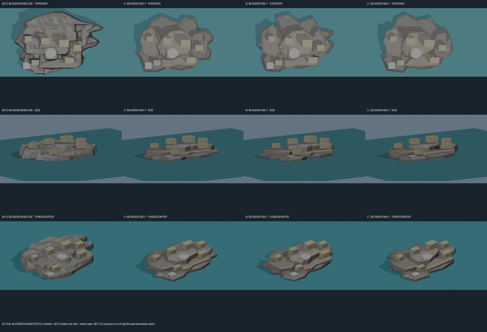
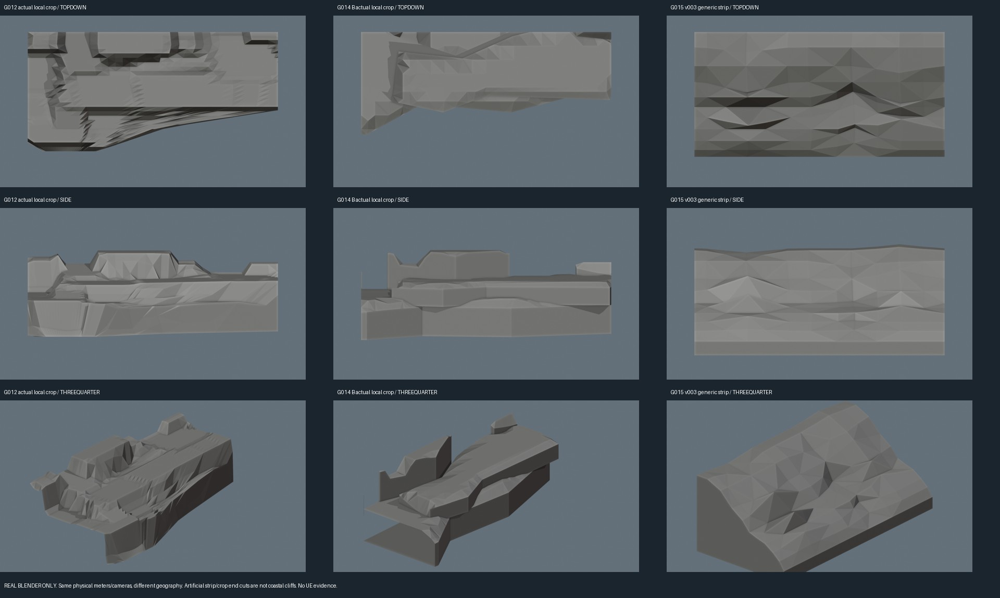
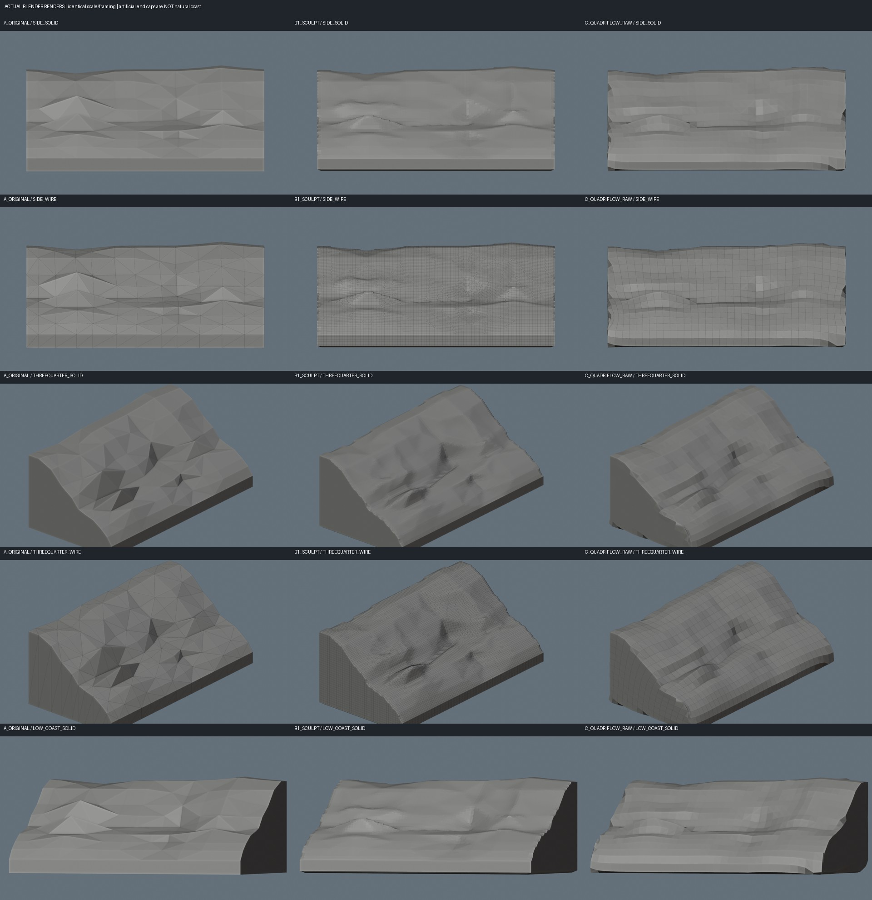
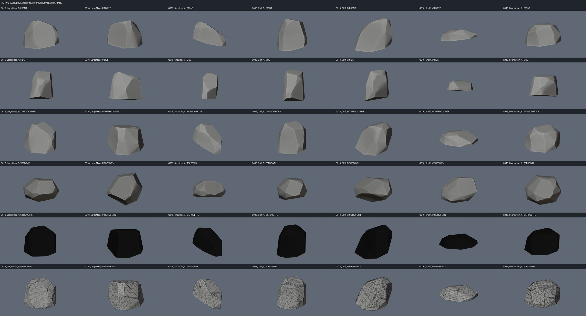
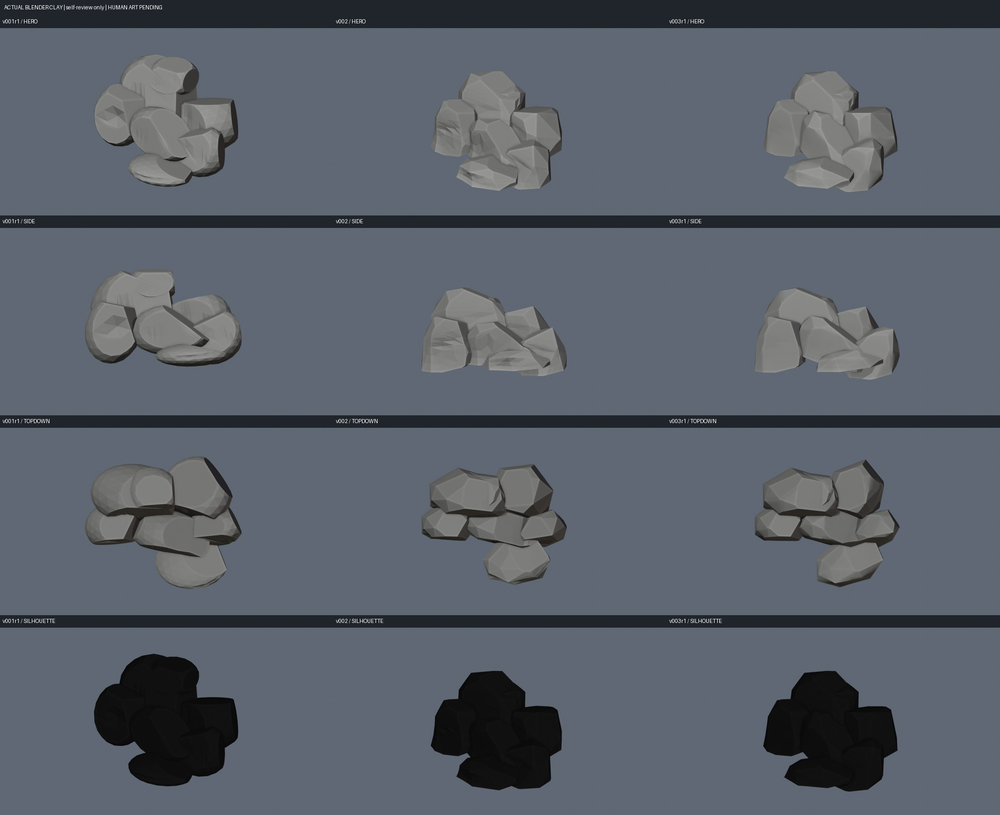
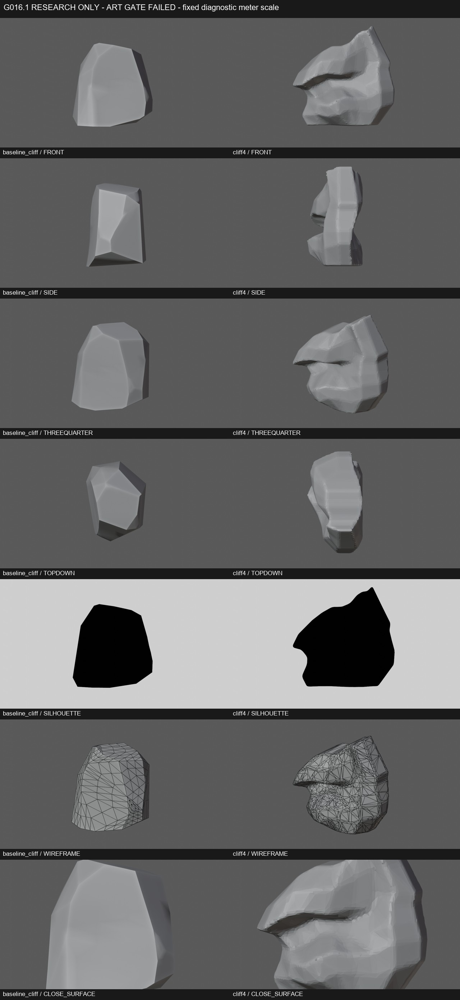
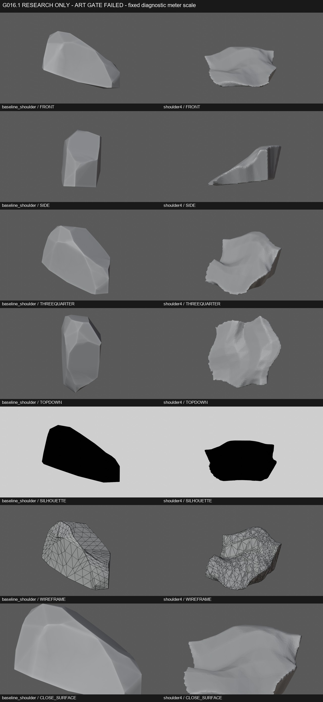
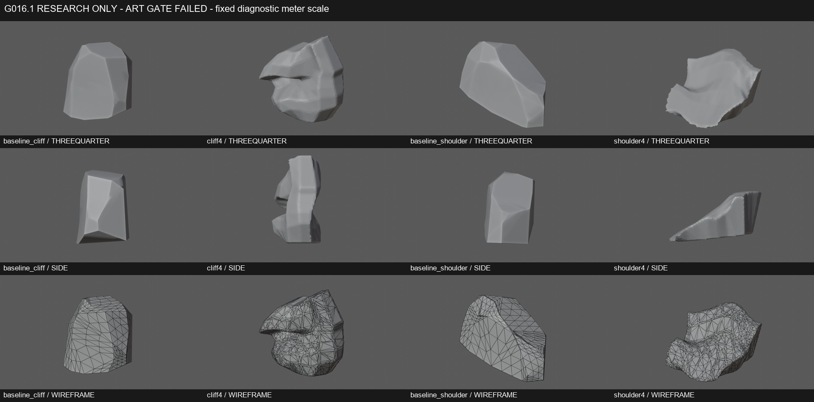

# Actual Blender research evidence — G014 to G016.1

This new additive page supplements the [process archive](README.md). Existing pages and images are unchanged. These are genuine Blender diagnostics, not illustrative SVGs, AI images or final environment art. G012 remains the retained scene; Human Art is pending; no canonical promotion.

## g014 three island proposals

Research evidence only. Failed forms and artificial caps remain visible. See image labels for physical-scale/camera limitations; side surfaces expose slab, wedge and closure defects.

## g015 section comparison

Research evidence only. Failed forms and artificial caps remain visible. See image labels for physical-scale/camera limitations; side surfaces expose slab, wedge and closure defects.

## g015 retopology review

Research evidence only. Failed forms and artificial caps remain visible. See image labels for physical-scale/camera limitations; side surfaces expose slab, wedge and closure defects.

## g016 rock kit overview

Research evidence only. Failed forms and artificial caps remain visible. See image labels for physical-scale/camera limitations; side surfaces expose slab, wedge and closure defects.

## g016 clay iterations

Research evidence only. Failed forms and artificial caps remain visible. See image labels for physical-scale/camera limitations; side surfaces expose slab, wedge and closure defects.

## g0161 cliff before after

Research evidence only. Failed forms and artificial caps remain visible. See image labels for physical-scale/camera limitations; side surfaces expose slab, wedge and closure defects.

## g0161 shoulder before after

Research evidence only. Failed forms and artificial caps remain visible. See image labels for physical-scale/camera limitations; side surfaces expose slab, wedge and closure defects.

## g0161 final review

Research evidence only. Failed forms and artificial caps remain visible. See image labels for physical-scale/camera limitations; side surfaces expose slab, wedge and closure defects.

## Validation is not art acceptance

G016.1 passed mesh and persistence checks but retained zero art assets. Voxel resampling and retopology did not fix the underlying volume design. The source captions and failures are preserved. Whole-image proportional resizing/JPEG compression only. No external concept art, private paths, account identifiers or raw agent logs included. [Media provenance and hashes](../../media/process/evidence-20261009/manifest.json).
