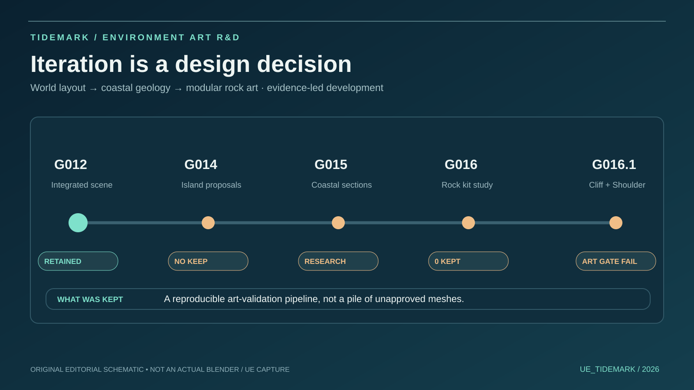
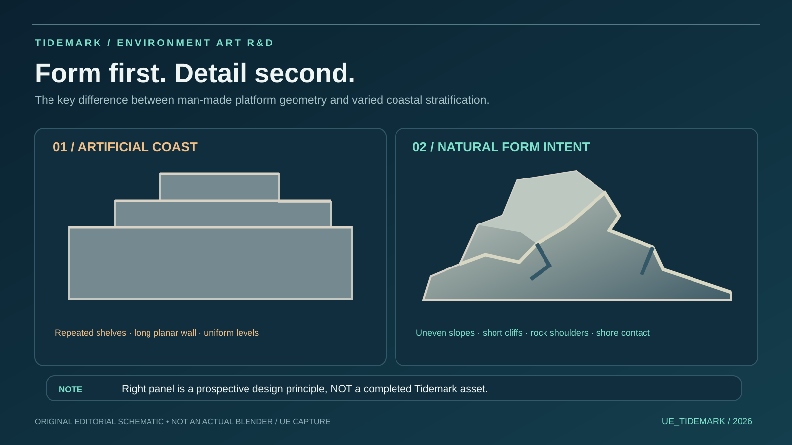
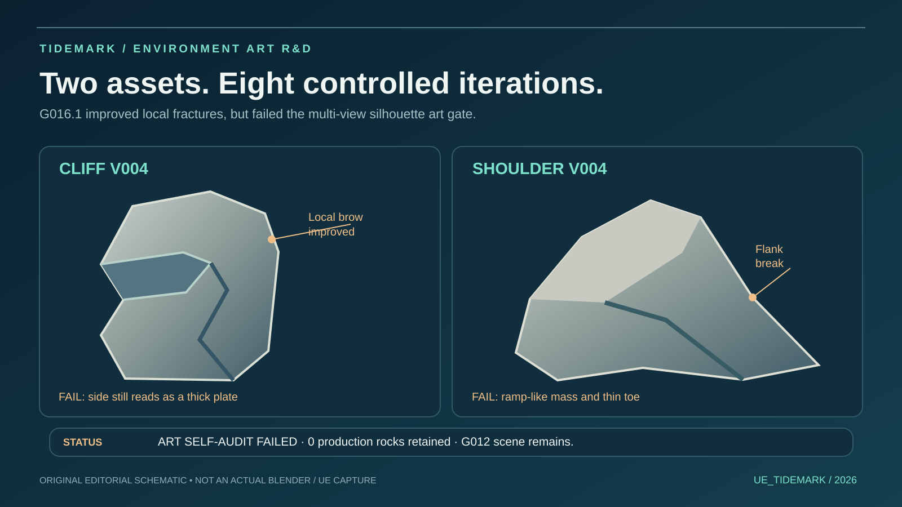
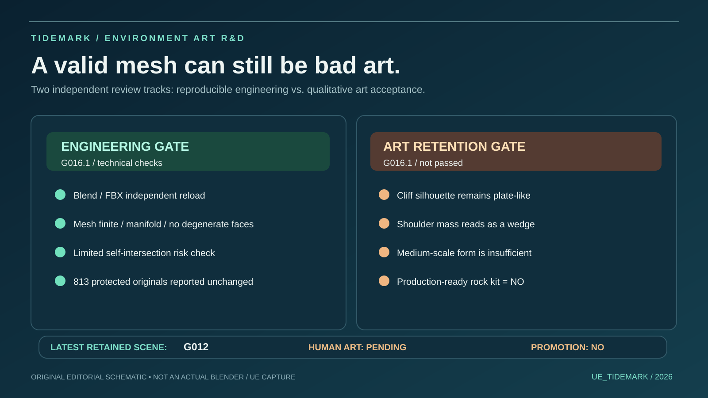

# Tidemark · Editorial Process Gallery

**A visual portfolio supplement — October 2026**

These four polished SVG images are **original explanatory illustrations**, not game-engine screenshots or reconstructions of the Blender models. They communicate verified R&D decisions without misrepresenting illustration as actual project output.

[← Development Process Archive](README.md) · [← Current Tidemark showcase](../../README.md)

### 01 / Research timeline

G012 remains the latest technically retained visual scene candidate. G014–G016.1 remained exploratory.

### 02 / Geological shape grammar

The *natural* example on the right illustrates a **future art target**, not a built or verified Tidemark asset.

### 03 / Cliff and Shoulder case study

Four iterations were attempted per asset in G016.1. Local recess/fracture improvements did not overcome the slab and wedge silhouette issues; both failed art retention.

### 04 / Technical and art gates

Technical checks can pass while the artwork fails. The later visual terrain was not certified walkable; Human Art remains PENDING and no canonical promotion has occurred.

### Real Unreal Engine evidence

This already-public image is a **real fixed-camera Unreal Engine capture** of the G012 candidate:

The original, real Blender process contact sheets remain separately available as governed project evidence and are **not replaced by these schematics**. No external concept art or unlicensed model is published in this gallery.

**Publishing boundary:** this collection adds only new media files and this page; no existing README, source, gameplay, protected map, or public image is overwritten.