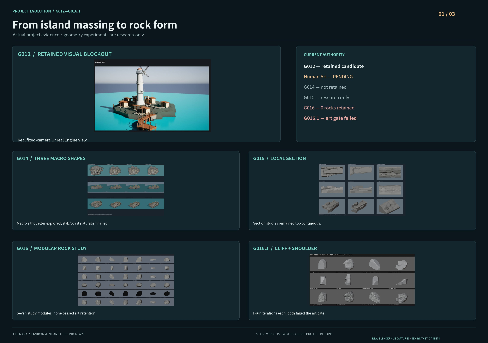
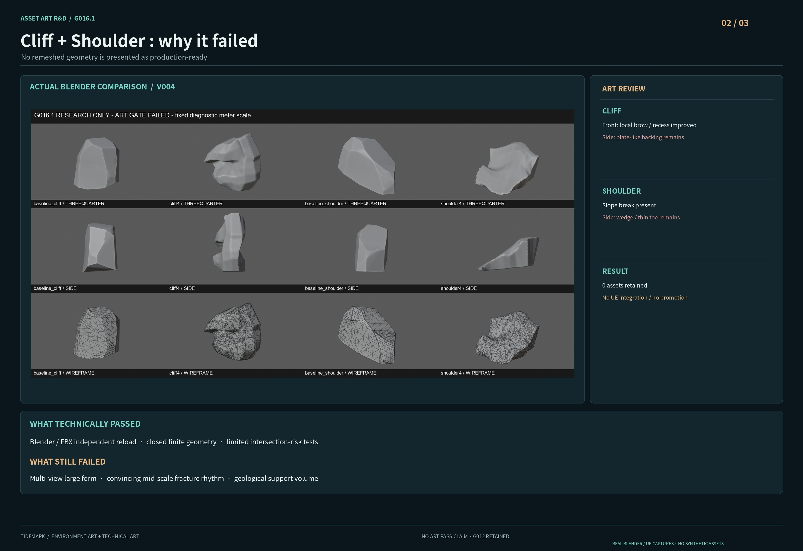
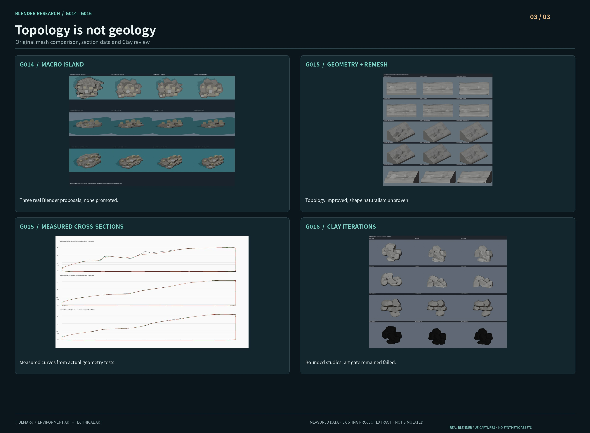

# Tidemark · Real Engineering Process Boards

**Visual development archive | G012–G016.1 | October 2026**

> These boards are laid out entirely from **real Unreal Engine and Blender project captures** supplied by the development record, with typography, cropping and captions added for portfolio presentation. They are not AI-generated asset renders, and should not be confused with accepted final art.

[← Development process archive](README.md) · [← Main showcase](../../README.md)

## 01 — From island massing to rock form

The G012 blockout remains the most recently **retained visual scene candidate** in the documented development sequence. Subsequent rock and coastal-shaping experiments provided technique and evaluation evidence, but were not retained as production environment assets. The board includes a genuine G012 Unreal capture alongside real Blender stage comparisons.

## 02 — Cliff and Shoulder: why the art gate failed

G016.1 tested two rock types with four bounded iterations each. Although local recess and fracture geometry improved, the Cliff's plate-like side profile and the Shoulder’s wedge/ramp character remained. Engineering checks passed while the required art self-review gate failed. **No production-ready rocks were retained.**

## 03 — Geology and topology validation

G014 explored three macro-island alternatives, G015 studied real coastal sections, and a topology bakeoff compared geometry modification techniques. Cleaner topology did not demonstrate a satisfactory geological silhouette, so those studies were held at research status rather than automatically promoted to the Unreal scene.

---

### Scope and provenance

- **Actual source media:** fixed-view Unreal G012 evidence and original local Blender clay, wireframe, contact-sheet, and geometry-validation screenshots from G014–G016.1.
- **Image editing scope:** layout, cropping, scale and captions; model geometry in screenshots is not fabricated or retouched to conceal failures.
- **Status:** G012 retained as a *visual candidate*; Human Art review **PENDING**; no canonical promotion; no new visual-terrain walkability certification.
- **Rights:** project-owned screenshots and original layout only; no third-party concept art embedded in these three boards.
- **Checksums:** see [media manifest](../../media/process/real-boards-20261009/MANIFEST.json) for the exact published JPG bytes and SHA-256 digests.

These boards document iterative technical-art practice and decision making, not a claim that G014–G016.1 achieved production art quality.
