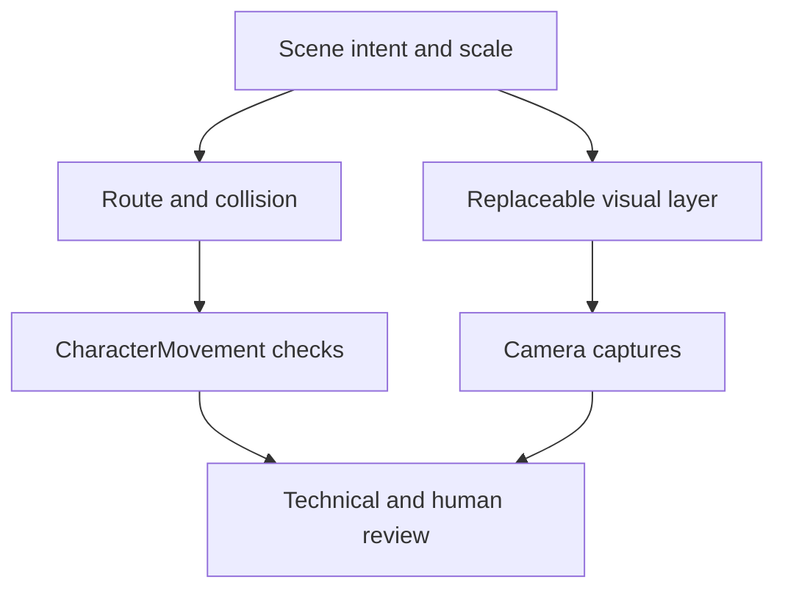
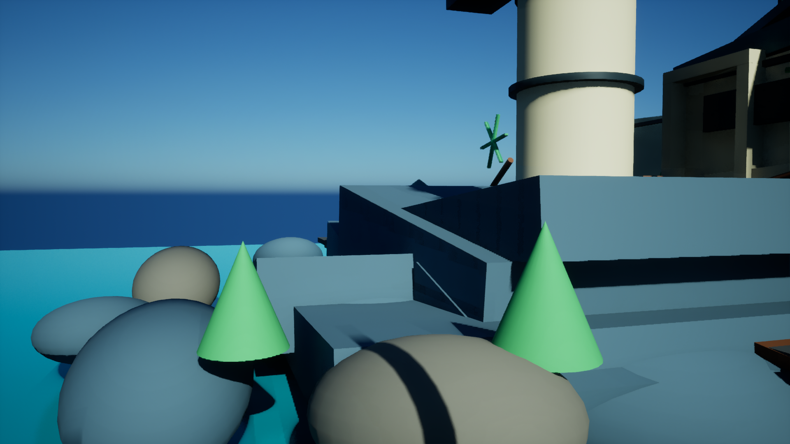
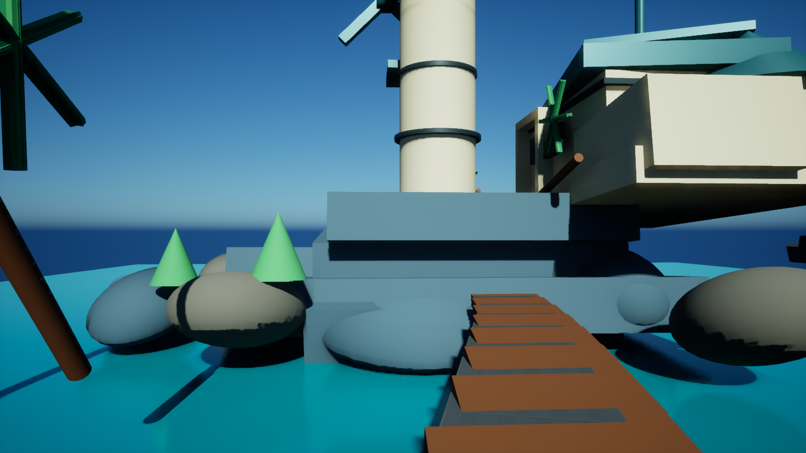

# Tidemark — 技术拆解

## 从视觉 intent 到可走空间

场景组织区分主岛、塔、建筑群、dock 与 boardwalk。视觉层按既定空间结构迭代，gameplay collision 单独维护，避免新增装饰自动成为角色障碍。

## Boardwalk / dock

截图展示空间连接与视觉层，不仅凭画面推断 capsule clearance 或 navigation 已在所有场景通过。

## Route view

该图是路线视角截图，不是实玩视频。既有 First Art Pass 阶段记录了实际 ACharacter + CharacterMovement 遍历：目标到达、5 个有序 trigger、该次运行中未记录 stuck / fall / capsule block / slope / step / ground gap / nav break。它是特定历史路线结果，不是当前每一地图或性能的保证。

静态 geometry sampling、core/mock validator 和真实角色运动属于不同证据层。保留失败基线，明确后续实际遍历的范围；不能通过更改报告来制造通过。

## 媒体归属

本次四张图均是项目自己的 UE 渲染截图。现有资产观察与 First Art Pass 生成方法表明被展示的模型来自 Engine BasicShapes 和项目自定义结构/常量材质；不发布源 mesh、engine package 或课程截图。

Unreal Engine 是 Epic Games 的技术与商标；相关 Engine 内容不获本仓库重新授权。参见 [Epic Unreal Engine EULA](https://www.unrealengine.com/eula/unreal) 的 rendered-output / Non-Engine Products 说明。本仓库没有为第三方内容赋予新的开源许可。
