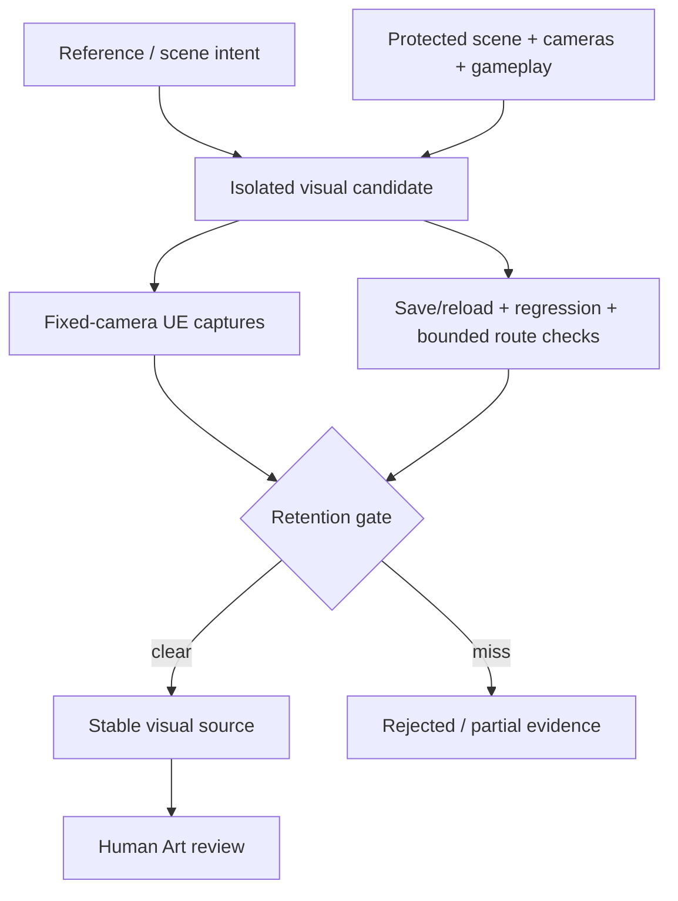

# Tidemark — 技术拆解

## 1. Separate authorities: visual, gameplay, review

Tidemark deliberately separates three questions:

1. **Does the scene read closer to the intended environment?**
2. **Can the bounded route / character test still work?**
3. **Has a human accepted the visual result?**

A newer candidate does not become the current build merely because it rendered successfully.

## 2. Current stable source: G004

The retained G004 pass improved the foreground boardwalk gesture, compact station and secondary service dock while preserving fixed protected cameras and protected assets.

Recorded evidence includes:
- 7/7 bounded Character feasibility PASS;
- save/reload PASS;
- protected regression PASS;
- boardwalk relation, water negative space, building cluster, secondary service dock and structural language PASS;
- island silhouette, rock stepping and slope plausibility still PARTIAL;
- Human Art still PENDING.

The stable-source decision is important: later geometry can be visually interesting and still be rejected.

## 3. Candidate isolation and protected-regression logic

Later G006–G011 work used isolated candidate maps / assets and explicit “do not promote” outcomes when visual thresholds were missed.

Examples:
- G006: stronger layered geology, but coast naturalism / building interface insufficient → rejected as stable replacement.
- G009: localized sculpting improved some regions, but the broad smooth incline / oval island read persisted → rejected.
- G010: stronger cluster density and layering, but integration and platform debt remained → PARTIAL / not retained.
- G011: stronger settlement asymmetry, mass variation and tower grounding, but overall massing, island silhouette, building-terrain integration and access logic remained PARTIAL → not retained.

This is a technical-art validation feature, not just project bookkeeping: the pipeline preserves failed visual hypotheses instead of letting “latest” overwrite “best verified.”

## 4. Visual / collision separation

Visual candidate components can remain **NoCollision** while the inherited gameplay surface, trigger logic and protected structures stay separate. This lets environment iteration move faster without automatically turning decorative geology or architecture into gameplay blockers.

That separation also means:
- analytical ground overlap is not a gameplay PASS;
- nominal route width is not full capsule-clearance proof;
- a Character test is not a Human Art PASS;
- fixed-camera image review is not production promotion.

## 5. Development-history media

The public repository currently contains older First Art Pass images:

These remain useful for showing the earlier visual/gameplay separation work, but they are no longer labeled as Current State.

## 6. Current media gap

Current project evidence records newer G004 fixed-camera HERO / C027 / OVERVIEW captures and later G011 review/contact-sheet captures. They were not added in this sync because the connected environment could verify their report paths and hashes but could not retrieve the original image bytes for a fresh publication gate.

No AI-generated substitute is used.

## 7. Public repository boundary

The showcase repository intentionally excludes:
- complete UE project;
- Saved / Intermediate / DDC / Build;
- third-party course assets;
- unverified-license source assets;
- agent logs;
- private machine paths;
- credentials.

The public repo is a review surface, not the canonical development store.
