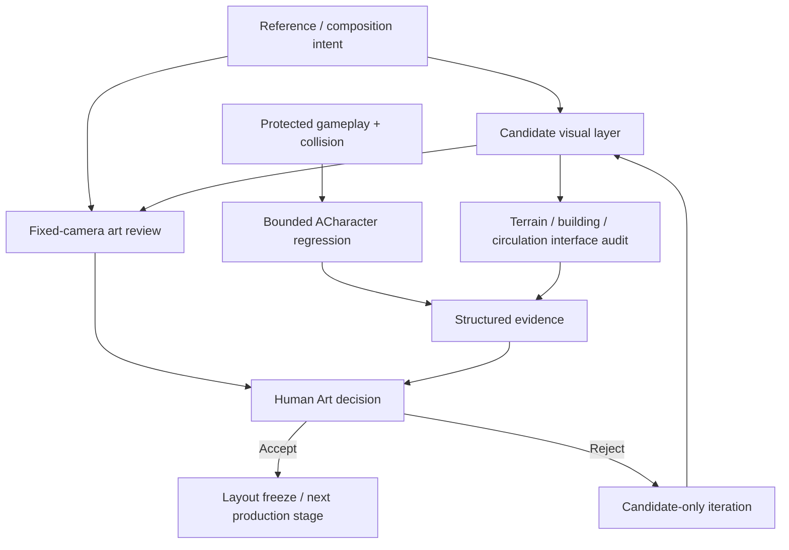

# Tidemark — Technical Overview

## Environment iteration model

Tidemark separates four concerns that are often mixed together during environment production:

1. **Reference / composition intent**
2. **Replaceable visual layer**
3. **Protected gameplay / collision layer**
4. **Validation and human review**

## Current retained candidate: G012

The latest retained candidate focuses on **visible settlement density and front-apron closure**.

Instead of adding many new rooms, the pass redistributes the same six primary room identities and improves how they read from the governed cameras. The current blockout establishes:

- asymmetric upper / mid / lower settlement bands
- improved tower support and grounding
- a clearer shore → lower room → stair / connector → yard sequence
- stronger front-slope occupation
- preserved boardwalk leading line and water gap
- unchanged protected cameras and lighting

## Visual / collision separation

The G012 visual layer remains **NoCollision** where appropriate and is intentionally decoupled from the gameplay surface.

The real Character regression uses the inherited G004 gameplay floors. This proves the protected gameplay route did not regress during the candidate pass; it does not prove the new visual terrain is directly walkable.

## Validation layers

Different checks answer different questions:

| Evidence layer | What it proves | What it does not prove |
| --- | --- | --- |
| Fixed-camera captures | visual state from governed viewpoints | Human Art acceptance |
| Geometry / contact audit | local foundations, route centers, intersections | full gameplay walkability |
| Protected-content hashes | protected source assets did not drift | visual quality |
| Save / reload checks | candidate persists correctly | production approval |
| ACharacter regression | inherited gameplay route remains viable | new visual terrain is walkable |
| Human review | whether the composition should advance | automatic promotion |

## Current G012 boundaries

G012 is **retained**, but:

- Human Art = PENDING
- canonical promotion = absent
- production gameplay approval = false
- final terrain naturalism = not passed
- final materials / vegetation / architecture = not complete

This distinction is deliberate: technical evidence can qualify a candidate for review, but it cannot self-authorize final art.
